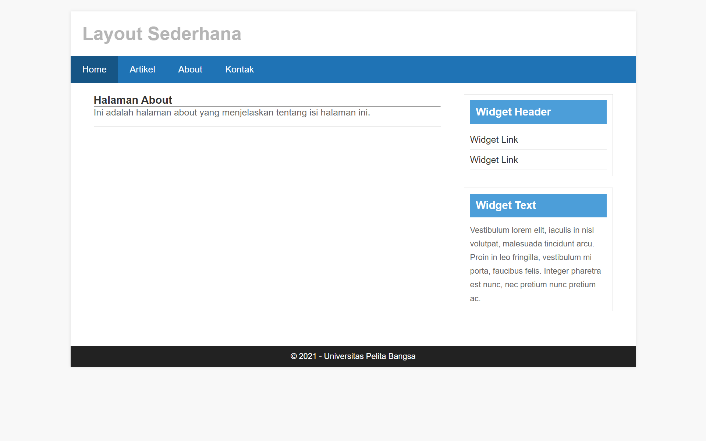
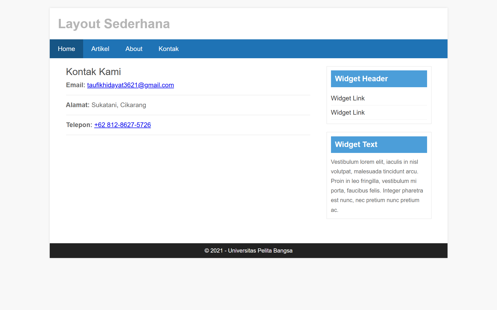

# PHP Framework (Codeigniter4)
| Praktikum 1-3  |  Pemrograman Web 2  
|-------|---------
| NIM   | 312310576
| Nama  | Taufik Hidayat
| Kelas | TI.23.A6
| Dosen |  Agung Nugroho, S.Kom., M.Kom.

## Praktikum 1

### Pertanyaan dan Tugas

- Lengkapi kode program untuk menu lainnya yang ada pada Controller Page, sehingga semua
link pada navigasi header dapat menampilkan tampilan dengan layout yang sama.

#### Controller/Page.php
```
<?php

namespace App\Controllers;

use App\Models\ArtikelModel;

class Page extends BaseController
{
    public function about()
    {
        return view('about', [
            'title'   => 'Halaman About',
            'content' => 'Ini adalah halaman about yang menjelaskan tentang isi halaman ini.'
        ]);
    }

    public function contact()
    {
        $data = [
            'title'   => 'Halaman Kontak',
            'email'   => 'taufikhidayat3621@gmail.com',
            'alamat'  => 'Sukatani, Cikarang',
            'telepon' => '+62 812-8627-5726'
        ];

        return view('contact', $data);
    }

    public function faqs()
    {
        echo "Ini halaman FAQ";
    }

    public function tos()
    {
        echo "Ini halaman Term of Services";
    }

    // Method untuk menampilkan daftar artikel
    public function artikel()
    {
        $artikelModel = new ArtikelModel();
        
        // Ambil semua artikel dan urutkan dari yang terbaru
        $data['artikel'] = $artikelModel->orderBy('id', 'DESC')->findAll();

        return view('artikel/index', $data);
    }
}
```
### Halaman About



### Halaman Kontak




## Praktikum 2
### Pertanyaan dan Tugas
- Selesaikan programnya sesuai Langkah-langkah yang ada. Anda boleh melakukan improvisasi
