# PHP Framework (Codeigniter4)
| Praktikum 1-3  |  Pemrograman Web 2  
|-------|---------
| NIM   | 312310576
| Nama  | Taufik Hidayat
| Kelas | TI.23.A6
| Dosen |  Agung Nugroho, S.Kom., M.Kom.

## Praktikum 1

### Pertanyaan dan Tugas

- Lengkapi kode program untuk menu lainnya yang ada pada Controller Page, sehingga semua
link pada navigasi header dapat menampilkan tampilan dengan layout yang sama.

#### Controller/Page.php
```
<?php

namespace App\Controllers;

use App\Models\ArtikelModel;

class Page extends BaseController
{
    public function about()
    {
        return view('about', [
            'title'   => 'Halaman About',
            'content' => 'Ini adalah halaman about yang menjelaskan tentang isi halaman ini.'
        ]);
    }

    public function contact()
    {
        $data = [
            'title'   => 'Halaman Kontak',
            'email'   => 'taufikhidayat3621@gmail.com',
            'alamat'  => 'Sukatani, Cikarang',
            'telepon' => '+62 812-8627-5726'
        ];

        return view('contact', $data);
    }

    public function faqs()
    {
        echo "Ini halaman FAQ";
    }

    public function tos()
    {
        echo "Ini halaman Term of Services";
    }

    // Method untuk menampilkan daftar artikel
    public function artikel()
    {
        $artikelModel = new ArtikelModel();
        
        // Ambil semua artikel dan urutkan dari yang terbaru
        $data['artikel'] = $artikelModel->orderBy('id', 'DESC')->findAll();

        return view('artikel/index', $data);
    }
}
```
### Halaman About


### Halaman Kontak


## Praktikum 2
### Pertanyaan dan Tugas
- Selesaikan programnya sesuai Langkah-langkah yang ada. Anda boleh melakukan improvisasi

#### Konfigurasi koneksi database di file (.env)

- Hapus (#) pada text konfigurasi database(.env)

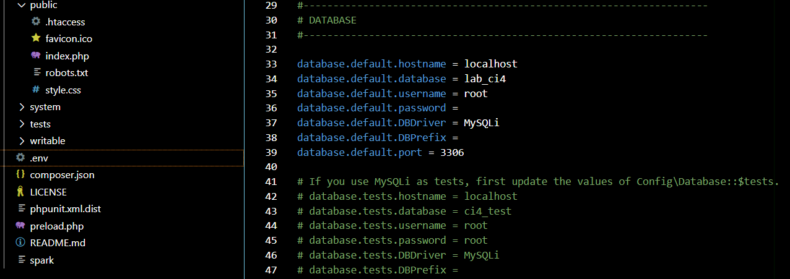


#### Membuat Database: Studi Kasus Data Artikel

- Buat database
  
```
CREATE DATABASE lab_ci4;
```

- Buat Table

```
CREATE TABLE artikel (
 id INT(11) auto_increment,
 judul VARCHAR(200) NOT NULL,
 isi TEXT,
 gambar VARCHAR(200),
 status TINYINT(1) DEFAULT 0,
 slug VARCHAR(200),
 PRIMARY KEY(id)
);
```

- Membuat Model file baru pada direktori app/Models dengan nama ArtikelModel.php

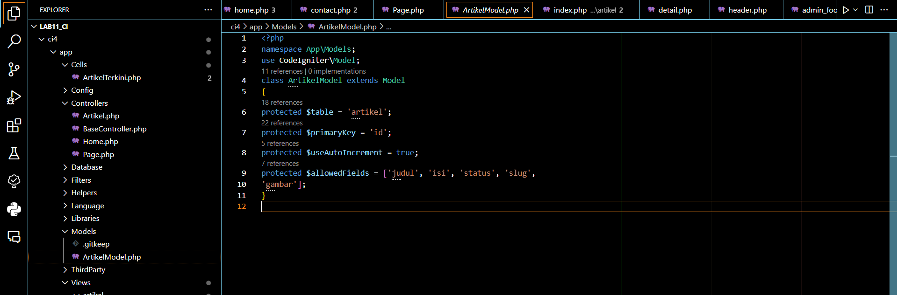

- Membuat Controller dengan nama Artikel.php pada direktori app/Controllers.

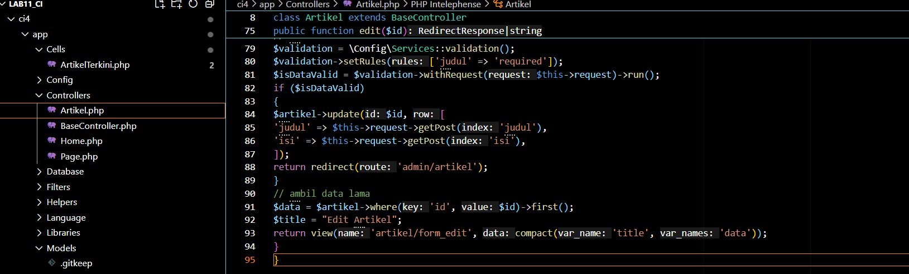

- Membuat View, buat direktori baru dengan nama artikel pada direktori app/views, kemudian buat file baru
dengan nama index.php.

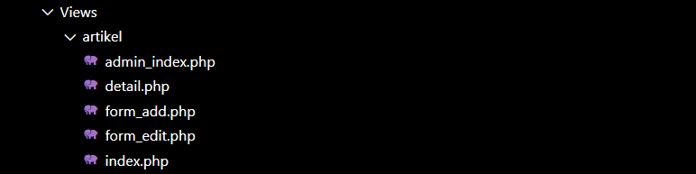

- Selanjutnya buka browser kembali, dengan mengakses url http://localhost:8080/artikel

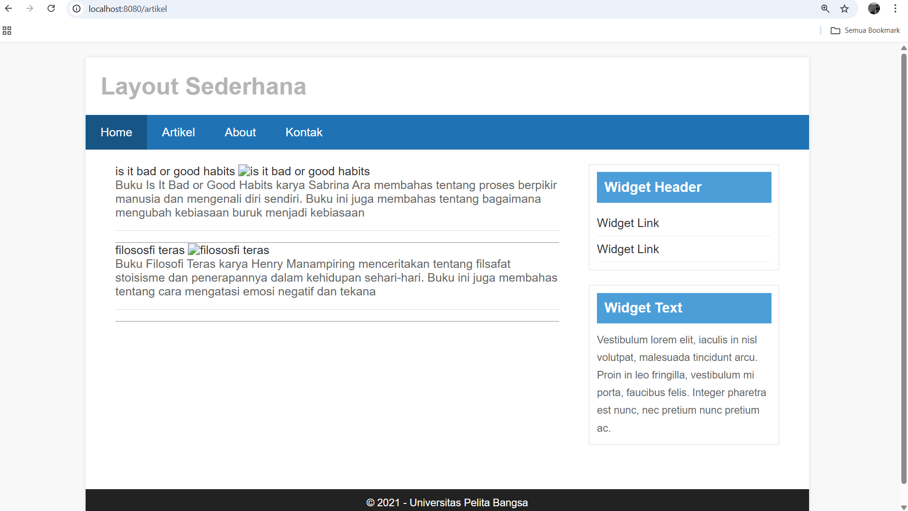

- Membuat Tampilan Detail Artikel, tambahkan fungsi baru pada Controller Artikel dengan nama view().

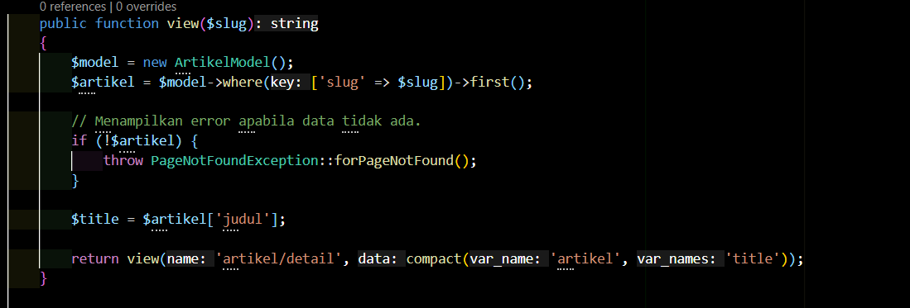

- Membuat View Detail, buatview baru untuk halaman detail dengan nama app/views/artikel/detail.php

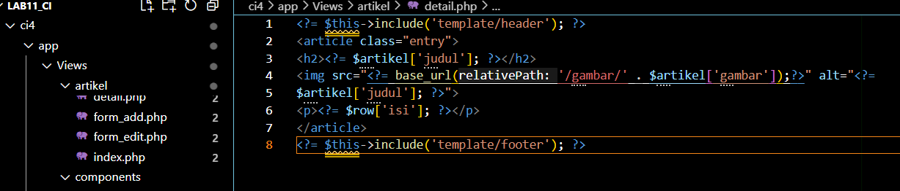

- Membuat Routing untuk artikel detail, buka Kembali file app/config/Routes.php, kemudian tambahkan routing untuk artikel detail

![image[(ss/ss10.png)

- Membuat Menu Admin untuk proses CRUD data artikel. Buat method baru pada Controller
Artikel dengan nama admin_index().

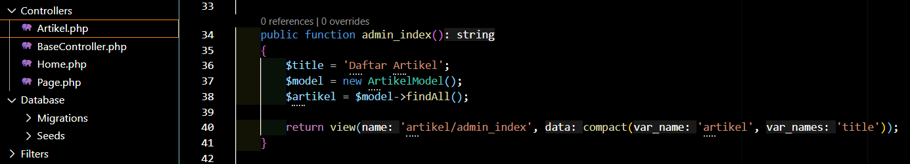

- Selanjutnya buat view di app/Views/artikel untuk tampilan admin dengan nama admin_index.php

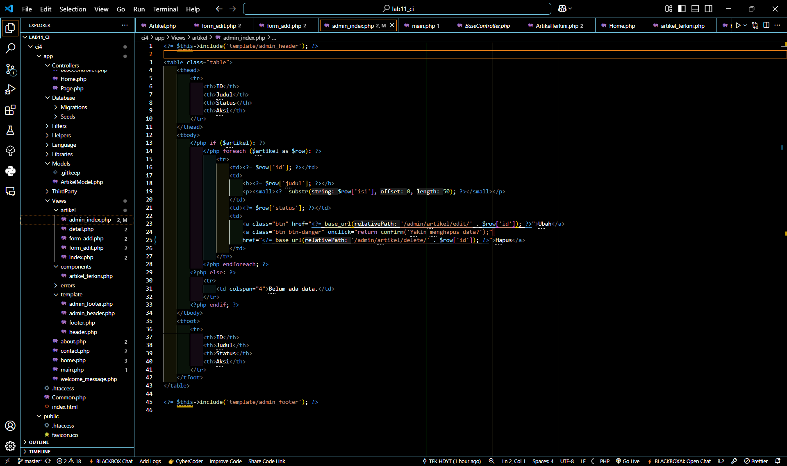

- Tambahkan routing untuk menu admin seperti berikut:

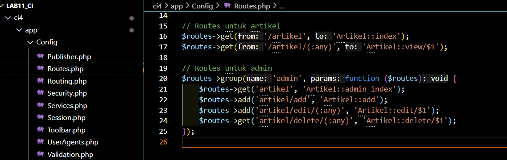

- Akses menu admin dengan url http://localhost:8080/admin/artikel

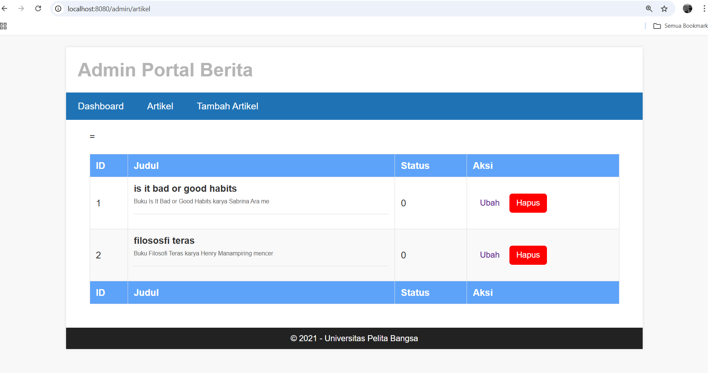

- Menambah Data Artikel, tambahkan fungsi/method baru pada Controller Artikel dengan nama add()

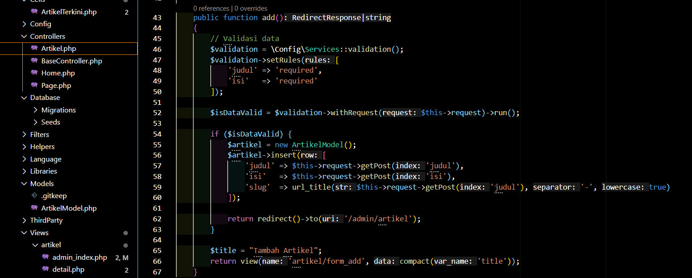

- Kemudian buat view untuk form tambah dengan nama form_add.php

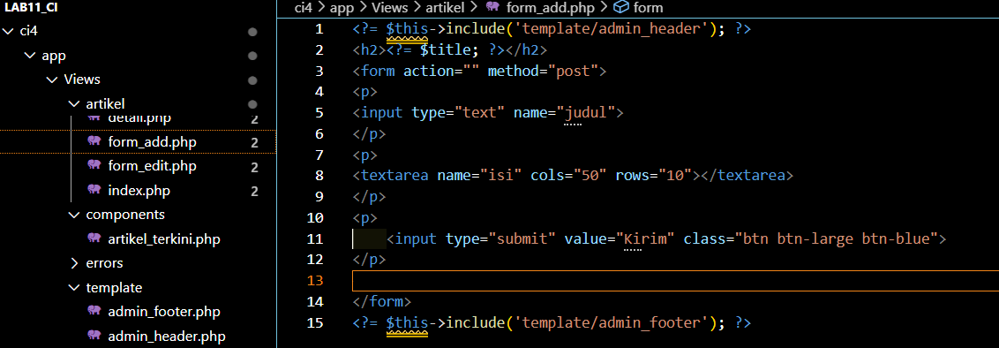

- tampilan di http://localhost:8080/admin/artikel/add

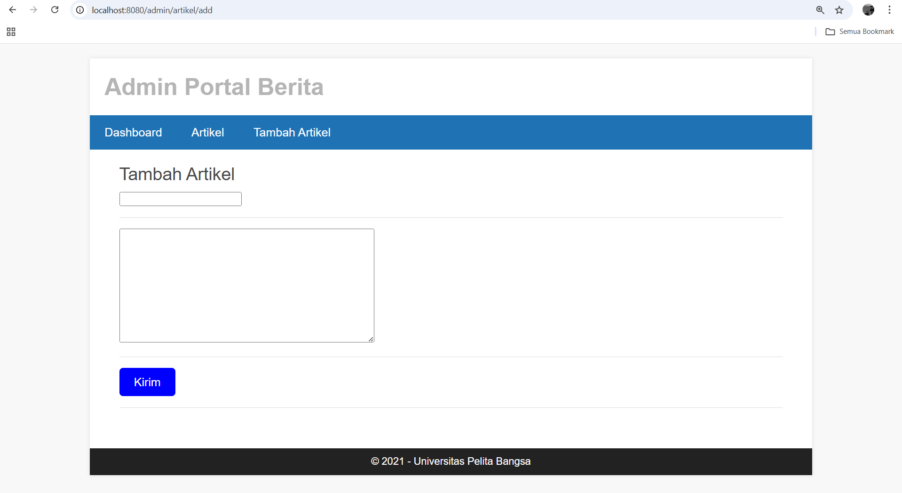

- Mengubah Data, tambahkan fungsi/method baru pada app/Controller/Artikel dengan nama edit()

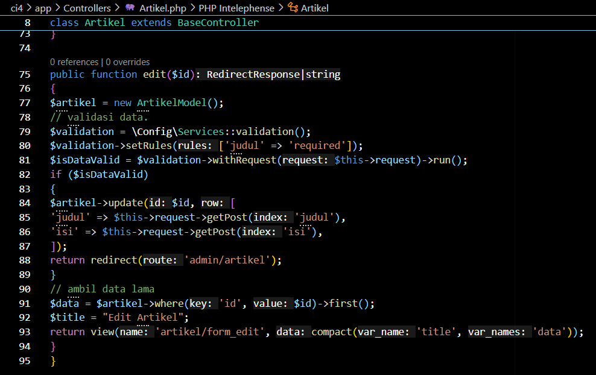

- Kemudian buat file view di lokasi file Views/artikel/form_edit.php

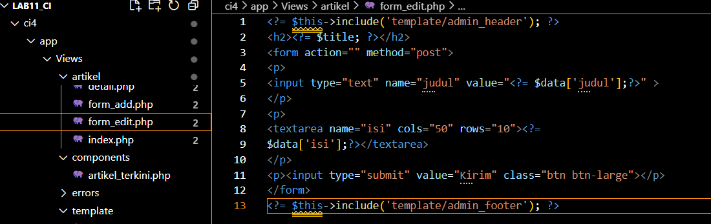

- tampilan di http://localhost:8080/admin/artikel/edit/1

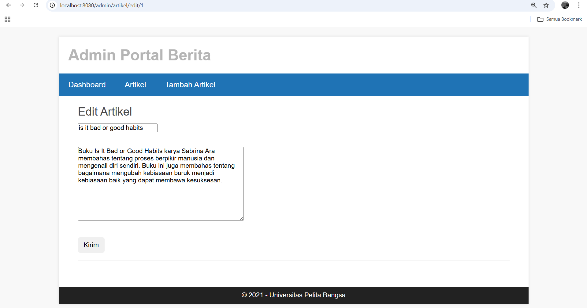

- Menghapus data, tambahkan fungsi/method baru pada app/Controller/Artikel dengan nama delete().

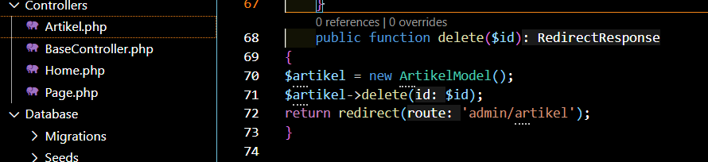


## Praktikum 3
### Pertanyaan dan Tugas

- Sesuaikan data dengan praktikum sebelumnya, perlu melakukan perubahan field pada
database dengan menambahkan tanggal agar dapat mengambil data artikel terbaru.

- Selesaikan programnya sesuai Langkah-langkah yang ada. Anda boleh melakukan
improvisasi.

- Apa manfaat utama dari penggunaan View Layout dalam pengembangan aplikasi?

- Jelaskan perbedaan antara View Cell dan View biasa.

- Ubah View Cell agar hanya menampilkan post dengan kategori tertentu.


### Membuat Layout Utama

- Buat folder layout di dalam app/Views/

- Buat file main.php di dalam folder layout dengan kode berikut:

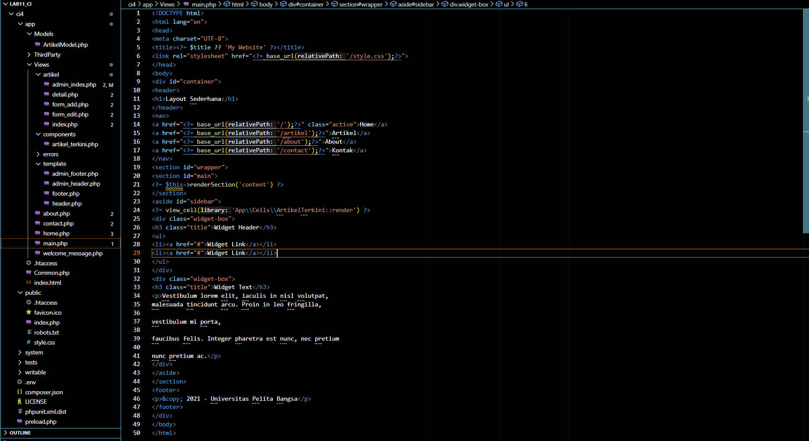

### Modifikasi File View
- Ubah app/Views/home.php agar sesuai dengan layout baru:

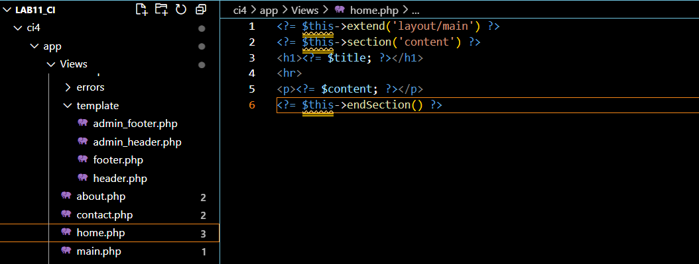

### Membuat Class View Cell

- Buat folder Cells di dalam app/

- Buat file ArtikelTerkini.php di dalam app/Cells/ dengan kode berikut:

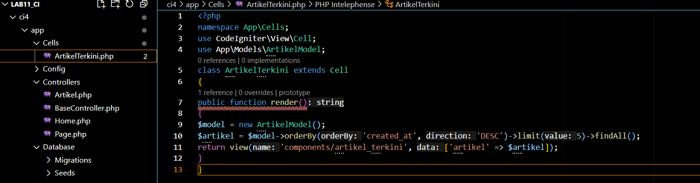

### Membuat View untuk View Cell

- Buat folder components di dalam app/Views/

- Buat file artikel_terkini.php di dalam app/Views/components/ dengan kode berikut:

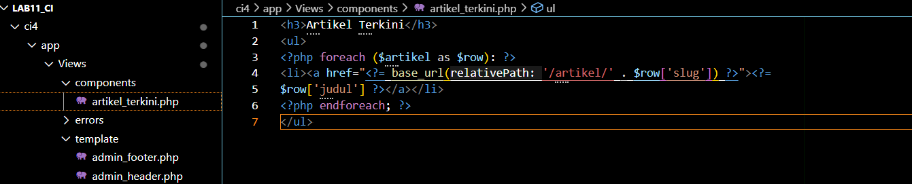 

### tampilan di http://localhost:8080/

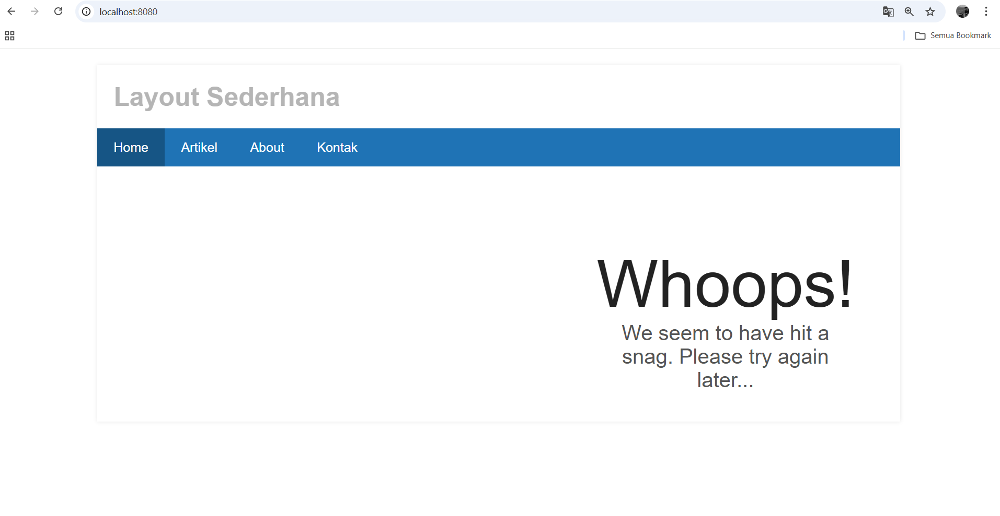 


### Apa manfaat utama dari penggunaan View Layout dalam pengembangan aplikasi?

- Manfaat utama dari View Layout adalah bikin kode lebih rapi dan gampang dikelola. Bagian yang sama kayak header, footer, atau sidebar cukup dibuat sekali, jadi nggak perlu ditulis ulang di setiap halaman. Ini bikin kerja lebih cepat, tampilan lebih konsisten, dan kalau mau edit sesuatu, cukup ubah di satu tempat aja.

### Jelaskan perbedaan antara View Cell dan View biasa.

Perbedaan utama antara View Cell dan View biasa ada di cara penggunaannya:

- View biasa dipakai buat nampilin halaman atau bagian dari halaman secara langsung. Biasanya dipanggil dari controller pakai return view('namaview', $data), dan isinya bisa berupa HTML + PHP yang ngolah data dari controller.

- View Cell lebih fleksibel karena bisa dipanggil di dalam view lain. Ini cocok buat komponen kecil yang sering dipakai ulang, kayak sidebar, widget, atau daftar artikel terbaru. Panggilannya pakai <?= view_cell('NamaClass::method') ?>, jadi bisa load data langsung tanpa harus lewat controller dulu.

Simpelnya, View biasa buat nampilin halaman utama, sedangkan View Cell buat nge-load bagian kecil dari halaman secara dinamis.


# SELESAI
