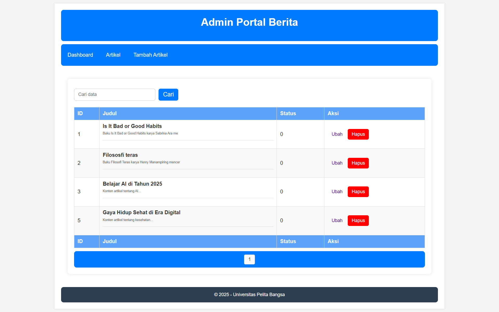

# PHP Framework (Codeigniter4)
| Praktikum 1-5  |  Pemrograman Web 2  
|-------|---------
| NIM   | 312310576
| Nama  | Taufik Hidayat
| Kelas | TI.23.A6
| Dosen |  Agung Nugroho, S.Kom., M.Kom.

## Praktikum 1

Lengkapi kode program untuk menu lainnya yang ada pada Controller Page, sehingga semua
link pada navigasi header dapat menampilkan tampilan dengan layout yang sama.

- Halaman About

- Artikel

- Kontak

## Praktikum 2

Selesaikan programnya sesuai Langkah-langkah yang ada.

- Admin Portal Berita

- Add Data

- Edit Data

## Praktikum 4
-  Halaman Login dengan filter Auth pada Config/Routes.php, menyimpan database dengan UserSeeder.

- Setelah Login & Masuk ke halaman Admin Artikel.

## Praktikum 5
- Membuat Pagination

Pagination merupakan proses yang digunakan untuk membatasi tampilan yang panjang
dari data yang banyak pada sebuah website. Fungsi pagination adalah memecah tampilan
menjadi beberapa halaman tergantung banyaknya data yang akan ditampilkan pada
setiap halaman.

Untuk membuat pagination, buka Kembali App/Controller/Artikel, kemudian modifikasi kode
pada method public function admin_index seperti berikut.

Kemudian buka kembali file App/Views/artikel/admin_index.php dan tambahkan form
pencarian sebelum deklarasi tabel seperti berikut:

Dan pada link pager ubah seperti berikut.
App/Views/artikel/admin_index.php bagian paling bawah diatas footer

Hasilnya akan seperti ini:

